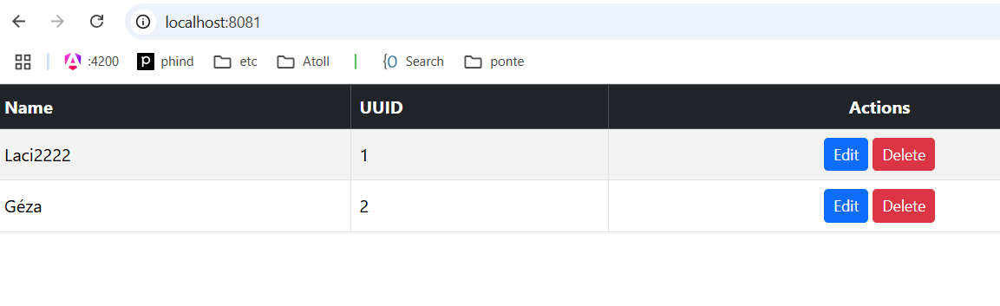
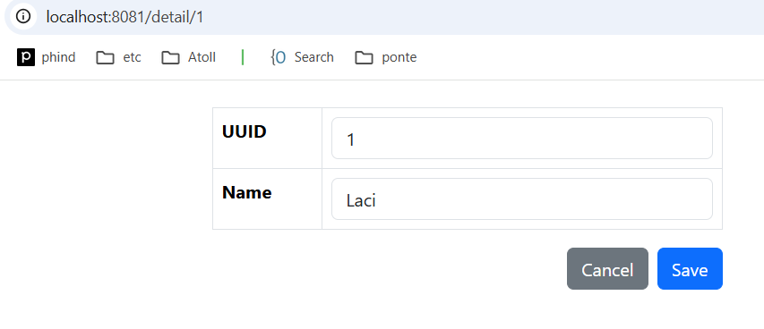
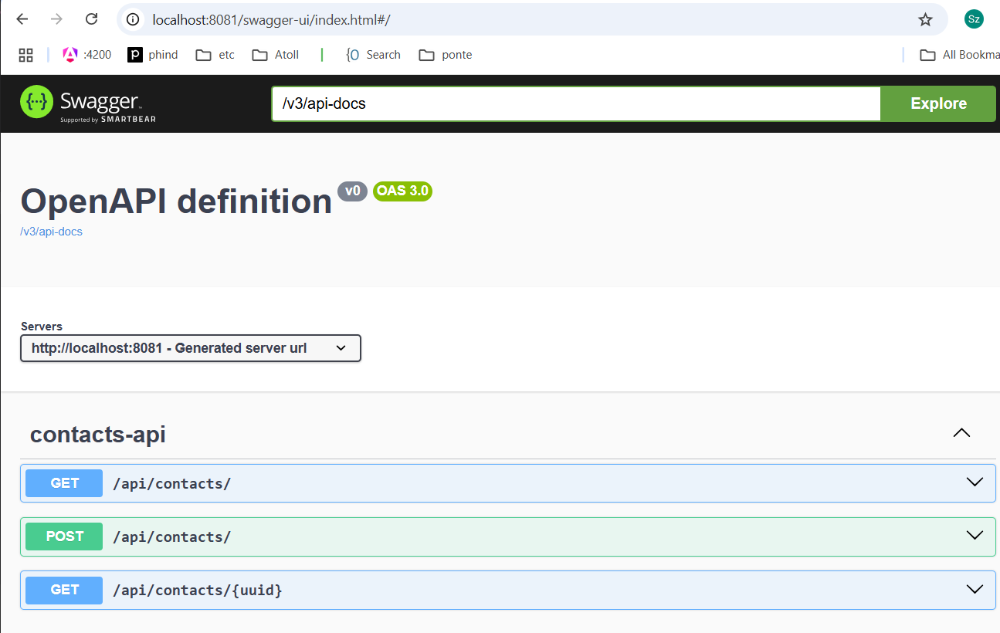

### Pár szót szólnék informálisan

A feladat elég tetemes mennyiségű munkát foglalt magában. Remélem, hogy ez egy Star Trek Kobayashi Maru jellegű feladat, ugyanis ennyi idő alatt nem lehet megoldani. Mivel full-stack fejlesztő vagyok, ezért az volt a célom, hogy egy olyan MVP-t adjak át, ami elejétől a végéig rendben van. Amire lehet építkezni tovább, kiosztható részfeladatokra más fejlesztőknek. A backend adatbázisba ment, rest apival kommunikál, a frontend-en vannak listák, szerkeszthetőek, amelyeket az api-val használ, routeok és nagyon minimál design. Mindez dockerizálható, és konténerben önállóan elindítható. Ez megvalósítottam. 

- A fejlesztést egy WSL konténerben végeztem (párszor már volt tapasztalatom vele, most kiváncsiságból csak ezt használtam és jó volt)
- Futottam a JHipster-el, az azonban túlságosan gigantikus eredményt produkált, ezért inkább alulról építkeztem. 
- Használtam Copilot-ot és Chatgpt-t aktívan.

A teljes leírt specifikációt a kért funkciókkal legalább 10 MD, de inkább többre becsülném. Érthető, ha egy interjú munkára ez sok idő lenne.

Ha kérik, készítek egy részletesebb becslést, tartható határidőkkel. (ezt visszaolvasva, olyan mintha a chatgpt írta volna :D de azt csak kódolásra használtam)

# Készen van
 - Lapozható lista backenden
 - Swagger
 - WSL alapú fejlesztői környezet VSCode-ban
 - Backend Springboot, jpa, restapi
 - Frontend Angular, router, bootstrap
 - Docker 
 - Flyway alapú adatbázis verziókezelő
 - Makefile alapú fordítási leírás







## Ami még hátra lenne
 
### Backend
 - Security (LDAP/AD alapú auth)
 - Admin felhasználó
 - Önálló regisztráció
 - Végpontok levédése
 - Junit és integrációs tesztek
 - Kapcsolattartó-Telefonok-Címek relációk létrehozása
 - Postgresql
 - Api first átalakítás

### Frontend
 - reactive form validáció
 - reszponzívabb design
 - Többféle adattípus használata (dátum, szám)
 - kliens generálás automatikus és ne legyen a forráskódban

### CICD
  - Jenkins

# Tisztázandó funckió: 
 - biztosíts egy funkciót, amellyel a felhasználók egy gombnyomással törölhetik személyes adataikat az adatbázisból


## Pár lépés a fejlesztői környezet összerakásához
```
wsl --install -d Ubuntu
wsl --export Ubuntu ubuntu-base.tar
wsl --import ponte-poc D:\WSL\ponte-poc ubuntu-base.tar
wsl -d ponte-poc
```

### SDK
```
source "$HOME/.sdkman/bin/sdkman-init.sh"
sdk install java 17.0.9-tem
sdk use java 17.0.9-tem
java -version
```

### NVM
```
curl -o- https://raw.githubusercontent.com/nvm-sh/nvm/v0.39.7/install.sh | bash
nvm install 22.17.1
nvm use 22.17.1
```

### Docker (podman)
```
apt install -y podman
echo "alias docker=podman" >> ~/.bashrc
update-alternatives --config iptables
Válaszd ki a iptables-legacy verziót, ha elérhető.
```

### BACKEND
spring initializer weboldal

### FRONTEND
```
npm install -g @angular/cli@20
ng new frontend --routing --style=scss
cd frontend
npm start
```

## VSCODE
```
code .
```


